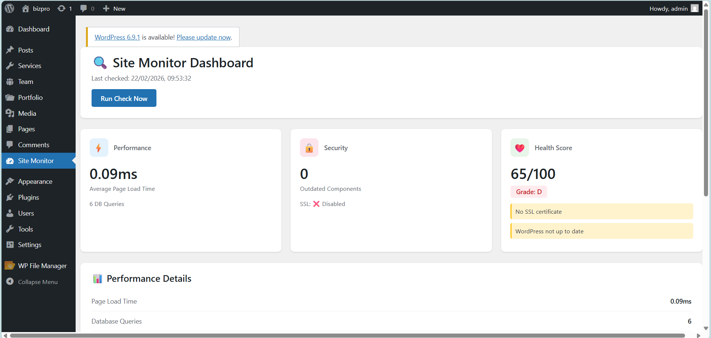
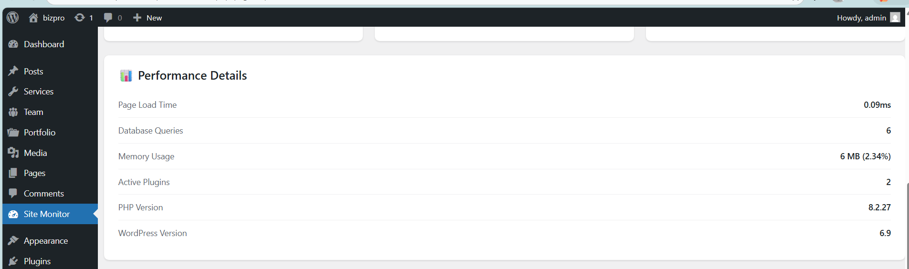
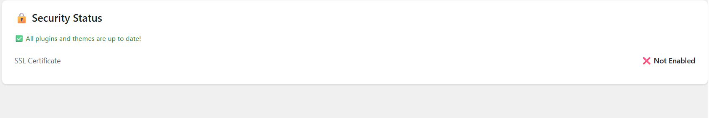

# WP Site Monitor

A comprehensive WordPress plugin for monitoring site performance, security, and overall health in real-time.


## Features

### Performance Monitoring
- **Page Load Time Tracking** - Monitor average page load times
- **Database Query Analysis** - Track number of queries per page
- **Memory Usage Stats** - Monitor PHP memory consumption
- **Server Response Time** - Track server response latency
- **Historical Data** - View performance trends over time

### Security Monitoring
- **Outdated Plugin Detection** - Alert when plugins need updates
- **Theme Update Tracking** - Monitor theme versions
- **SSL Certificate Status** - Verify HTTPS implementation
- **WordPress Version Check** - Ensure core is up-to-date
- **PHP Version Compatibility** - Check PHP version support
- **File Permission Audit** - Verify critical file security

### Health Monitoring
- **Disk Space Tracking** - Monitor server disk usage
- **Database Size Analysis** - Track database growth
- **Uploads Directory Size** - Monitor media library size
- **Overall Health Score** - Get A-F grade for site health
- **WP Cron Status** - Verify scheduled tasks work
- **REST API Status** - Check API accessibility

### Alert System
- **Email Notifications** - Get alerts for critical issues
- **Configurable Thresholds** - Set custom alert triggers
- **Daily Summary Reports** - Receive scheduled summaries
- **Severity Levels** - Info, Warning, and Critical alerts

### Interactive Dashboard
- **Real-Time Metrics** - View current site status
- **Historical Charts** - Visualize trends over time
- **One-Click Manual Check** - Run checks on demand
- **Clean, Modern UI** - Intuitive dashboard interface

## Tech Stack

### Backend (WordPress Plugin)
- **Object-Oriented PHP** - Classes, namespaces, and interfaces
- **WordPress REST API** - Custom endpoints for data
- **WP Cron** - Automated hourly monitoring
- **WordPress Settings API** - Configuration management
- **Custom Database Tables** - Historical data storage

### Frontend (Admin Dashboard)
- **React 18** - Modern UI framework
- **JavaScript ES6+** - Modern JavaScript features
- **CSS3** - Responsive styling
- **WordPress REST API** - Data fetching
- **Fetch API** - HTTP requests

## Requirements

- **WordPress:** 5.8 or higher
- **PHP:** 7.4 or higher
- **MySQL:** 5.6 or higher
- **Server:** Apache or Nginx

## Installation

1. Download the plugin ZIP file or clone this repository:
```bash
git clone https://github.com/suryayousufzai/wp-site-monitor.git
```

2. Upload to `/wp-content/plugins/wp-site-monitor/`

3. Activate the plugin through the WordPress admin panel

4. Navigate to **Site Monitor** in the admin menu

## Usage

### Viewing the Dashboard

After activation, click **Site Monitor** in the WordPress admin menu to access the monitoring dashboard.

### Running Manual Checks

Click the **"Run Check Now"** button to perform an immediate monitoring scan of all systems.

### Configuring Settings

Settings are available through the WordPress REST API endpoints:
- `GET /wp-json/wp-site-monitor/v1/settings` - Get current settings
- `POST /wp-json/wp-site-monitor/v1/settings` - Update settings

### Email Alerts

Configure email alerts in the settings:
```json
{
  "enable_email_alerts": true,
  "alert_email": "admin@example.com",
  "performance_threshold": 3
}
```

## API Endpoints

### Get Current Status
```
GET /wp-json/wp-site-monitor/v1/status
```

Returns current metrics from all monitors (performance, security, health).

### Get Historical Data
```
GET /wp-json/wp-site-monitor/v1/history/{type}?days=7
```

Parameters:
- `type`: `performance`, `security`, or `health`
- `days`: Number of days of historical data (default: 7)

### Run Manual Check
```
POST /wp-json/wp-site-monitor/v1/check
```

Triggers immediate monitoring scan and stores results.

### Get/Update Settings
```
GET  /wp-json/wp-site-monitor/v1/settings
POST /wp-json/wp-site-monitor/v1/settings
```

## Database Schema

The plugin creates a custom table `wp_site_monitor_data`:

| Column | Type | Description |
|--------|------|-------------|
| id | BIGINT | Primary key |
| monitor_type | VARCHAR(50) | Type: performance, security, health |
| metric_name | VARCHAR(100) | Name of the metric |
| metric_value | TEXT | JSON-encoded value |
| severity | VARCHAR(20) | info, warning, critical |
| checked_at | DATETIME | Timestamp of check |

## How It Works

### 1. Scheduled Monitoring
- WP Cron runs hourly checks automatically
- Each monitor (Performance, Security, Health) collects metrics
- Data is stored in the custom database table
- Email alerts are sent if critical issues are detected

### 2. Real-Time Dashboard
- React app fetches data from REST API endpoints
- Displays current status and historical trends
- "Run Check Now" triggers manual on-demand scan
- Auto-refreshes to show latest data

### 3. Alert System
- Compares metrics against configured thresholds
- Determines severity: Info, Warning, or Critical
- Sends email notifications for critical issues
- Daily summary emails provide overview

## Code Quality

This project demonstrates:
- ✅ **OOP PHP** - Proper class structure and separation of concerns
- ✅ **WordPress Coding Standards** - Follows official WP guidelines
- ✅ **RESTful API Design** - Clean, consistent endpoints
- ✅ **Security Best Practices** - Nonce verification, sanitization
- ✅ **Modern JavaScript** - ES6+, async/await, fetch API
- ✅ **Responsive Design** - Mobile-friendly admin interface
- ✅ **Database Optimization** - Indexed queries, efficient storage
- ✅ **Error Handling** - Try-catch, validation, fallbacks

## Security Features

- **Capability Checks** - Only admins can access monitoring data
- **Nonce Verification** - CSRF protection on all API calls
- **Data Sanitization** - All inputs are sanitized and validated
- **SQL Injection Prevention** - Prepared statements for all queries
- **XSS Protection** - Output escaping where needed

## Screenshots

### Dashboard Overview


### Performance Metrics


### Security Status


## Contributing

This is a portfolio project demonstrating WordPress plugin development skills. Feedback and suggestions are welcome!

## License

This project is licensed under the GPL v2 or later - see the [LICENSE](LICENSE) file for details.

## Author

**Surya Yousufzai**
- Portfolio: [suryayousufzai.github.io](https://suryayousufzai.github.io)
- GitHub: [@suryayousufzai](https://github.com/suryayousufzai)
- Email: surya.yousufzai@auaf.edu.af

## Acknowledgments

Built with:
- [WordPress](https://wordpress.org/) - Content management system
- [React](https://react.dev/) - UI framework
- [PHP](https://www.php.net/) - Server-side language

---

**Note:** This plugin is designed as a portfolio project to demonstrate WordPress development capabilities, including OOP PHP, REST API integration, database design, and modern frontend development.